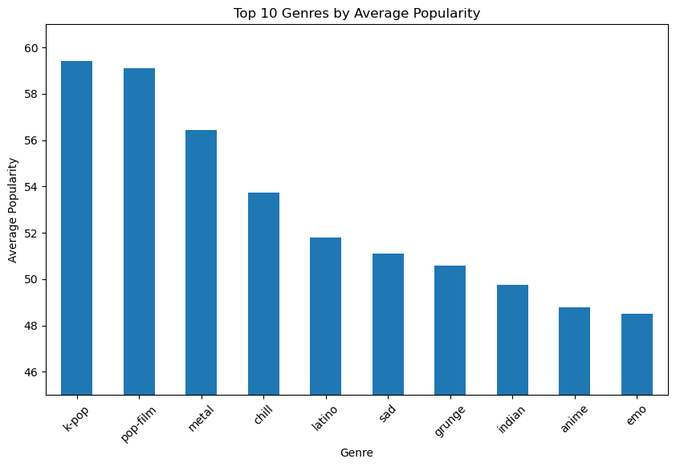
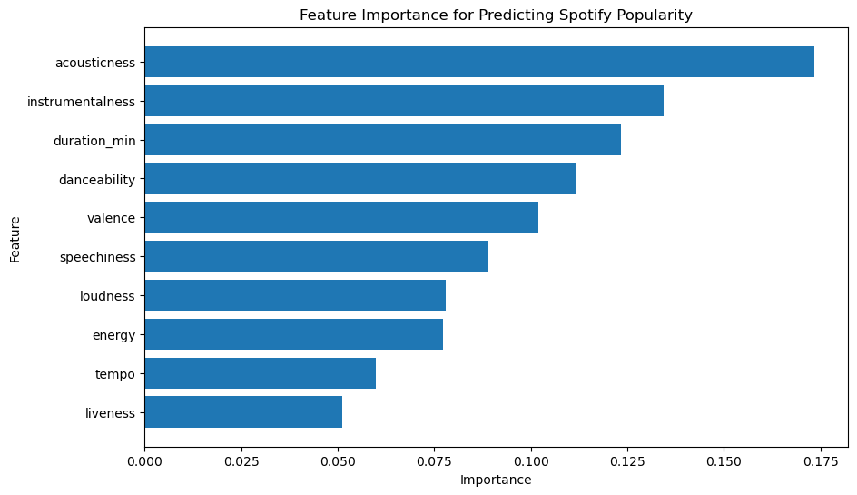
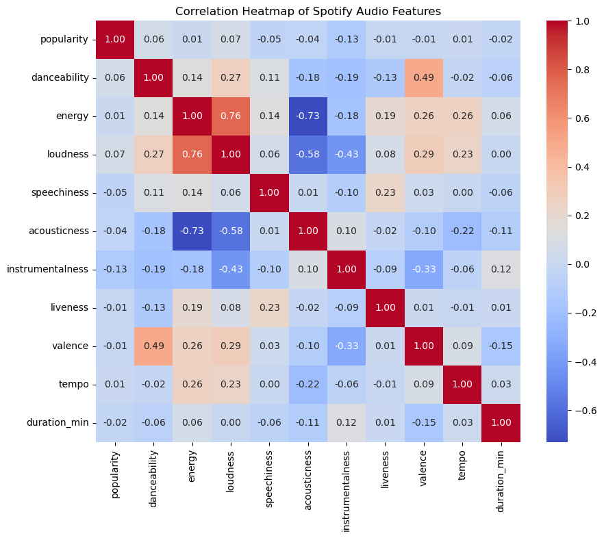

# Spotify Popularity Prediction

This project analyzes Spotify track audio features and applies
machine learning models to predict song popularity. The project
includes exploratory data analysis, feature importance analysis,
correlation heatmaps, and Random Forest regression models.

(Built with Python, pandas, matplotlib, seaborn, and scikit-learn.)

## Dataset

The dataset contains Spotify tracks and audio features such as:

- danceability
- energy
- loudness
- acousticness
- tempo
- valence

## Project Goals

- Explore relationships between audio features and popularity
- Analyze popularity trends across genres
- Train a machine learning model to predict popularity
- Identify the most important audio features

## Genre Popularity Analysis

## Feature Importance

## Correlation Heatmap

## Machine Learning Model

A Random Forest Regressor was trained using Spotify audio features
to predict track popularity.

### Model Performance

- Mean Absolute Error (MAE): 15.37
- R² Score: 0.125

## Key Insights

- Loudness and energy were among the most important predictive features
- Popularity showed weak correlations with individual audio features
- Song popularity is influenced by many external factors beyond audio features alone

## Tools Used

- Python
- pandas
- matplotlib
- seaborn
- scikit-learn
- Jupyter Notebook

## Future Improvements

- Include additional metadata such as artist popularity and release year
- Experiment with advanced machine learning models
- Build an interactive dashboard for visualization
